# Beyond the Pokedex: What Makes a Pokemon Truly Powerful?

**1,032 Pokemon records analyzed across 8 generations to figure out what actually makes a Pokemon strong, and whether the game's systems back that up.**

---

## Table of Contents

- [Project Overview](#project-overview)
- [Dataset Summary](#dataset-summary)
- [Exploratory Data Analysis](#exploratory-data-analysis)
  - [Power Across Generations](#power-across-generations)
  - [Legendary vs Non-Legendary](#legendary-vs-non-legendary)
  - [BST vs Catch Rate](#bst-vs-catch-rate)
  - [Strongest and Weakest Types](#strongest-and-weakest-types)
  - [Legendary Distribution by Type](#legendary-distribution-by-type)
  - [Does Weight Matter?](#does-weight-matter)
  - [Final Evolution and Strength](#final-evolution-and-strength)
  - [Type Effectiveness and Defensive Vulnerability](#type-effectiveness-and-defensive-vulnerability)
  - [Z-Score Outliers](#z-score-outliers)
  - [Experience Growth and Strength](#experience-growth-and-strength)
  - [Which Stat Drives Overall Strength?](#which-stat-drives-overall-strength)
- [Key Takeaways](#key-takeaways)
- [Tools & Technologies](#tools--technologies)

---

## Project Overview

This project takes a detailed Pokemon dataset and tries to answer a simple question: **what actually determines how strong a Pokemon is?**

Not just "which Pokemon has the highest stats" but looking deeper. Does being heavier make you stronger? Are Legendary Pokemon really that much better? Does the game punish you for trying to catch strong Pokemon? Do final evolutions live up to the hype? Which typing gives you the best defense?

The dataset covers all 8 generations (up to Gen 8) and includes alternate forms like Mega Evolutions, Alolan forms, and Galarian forms. Each form is treated as its own entry since they have different battle stats.

**What was done:**

1. Loaded and explored a 1,032-row, 44-column Pokemon dataset
2. Added a Z-Score column to compare individual Pokemon strength against the population average
3. Analyzed BST (Base Stat Total) trends across generations, types, legendary status, evolution stage, weight, and catch rate
4. Computed correlation values to check which relationships actually hold up statistically
5. Calculated average damage taken per type to identify the most and least defensively vulnerable typings
6. Built visualizations (bar charts, scatter plots, violin plots, heatmaps, lollipop charts) using Matplotlib and Seaborn to back up every finding

---

## Dataset Summary

| Attribute | Detail |
|-----------|--------|
| **Total Records** | 1,032 Pokemon (including alternate forms) |
| **Columns** | 44 |
| **Pokedex Range** | #1 (Bulbasaur) to #898 |
| **Generations Covered** | 1 through 8 |
| **Primary Types (Type 1)** | 18 unique types |
| **Secondary Types (Type 2)** | 18 unique types (484 Pokemon have no secondary type) |
| **Legendary Pokemon** | 125 |
| **Non-Legendary Pokemon** | 907 |
| **Mega Evolutions** | 50 |
| **Alolan Forms** | 18 |
| **Galarian Forms** | 20 |
| **BST Range** | 175 (Wishiwashi) to 780 (Mega Mewtwo X/Y, Mega Rayquaza) |
| **Experience Types** | Medium Slow, Medium Fast, Fast, Slow, Fluctuating, Erratic |

**Key columns used in analysis:** `Name`, `Type 1`, `Type 2`, `HP`, `Att`, `Def`, `Spa`, `Spd`, `Spe`, `BST`, `Generation`, `Experience type`, `Final Evolution`, `Catch Rate`, `Legendary`, `Mega Evolution`, `Against [Type]` (18 columns), `Height`, `Weight`

---

## Exploratory Data Analysis

### Power Across Generations

| Generation | Avg BST |
|:----------:|:-------:|
| 1 | 407.64 |
| 2 | 407.18 |
| 3 | 407.99 |
| 4 | 451.93 |
| 5 | 433.85 |
| 6 | 508.67 |
| 7 | 450.64 |
| 8 | 443.83 |

Generations 1 through 3 were extremely consistent, all hovering around 407-408 average BST. Then Generation 4 bumped it up to 451.93, and Generation 6 blew everything out with 508.67. That spike in Gen 6 makes sense because that's when Mega Evolutions were introduced, which brought a bunch of 600+ BST forms into the mix. After that, Gen 7 and 8 settled back down into the 440-450 range.

The takeaway here is that Pokemon haven't been getting consistently stronger over time. The power creep everyone talks about isn't really a straight line. It's more like spikes tied to specific mechanics (Megas, Primals) rather than a gradual increase.

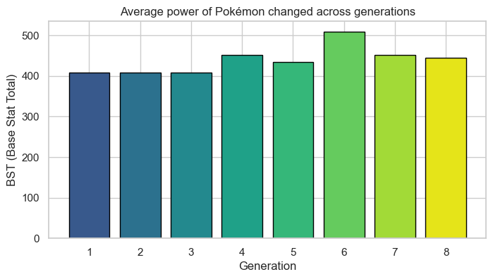
---

### Legendary vs Non-Legendary

| Category | Avg BST |
|----------|:-------:|
| Non-Legendary | 415.08 |
| Legendary | 609.66 |

Legendary Pokemon are roughly **47% stronger** on average than regular Pokemon. An average BST difference of ~194 points is massive. That's basically the difference between a first-stage Pokemon and a fully evolved one.

Out of 1,032 total entries, 125 are Legendary (about 12%). They make up a small slice of the roster but sit way above everyone else in terms of raw stats. The game clearly designs Legendaries to feel special through numbers, not just through lore.

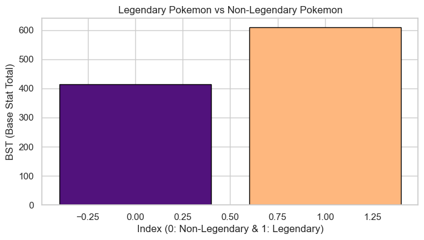

---

### BST vs Catch Rate

**Correlation: r = -0.704 (strong negative)**

This one is straightforward but worth confirming with data. Stronger Pokemon are harder to catch. The correlation of -0.704 is strong enough to say this isn't random. The game intentionally balances powerful Pokemon by making them less accessible.

If you look at the scatter plot, the trend line slopes down clearly. High-BST Pokemon cluster at the bottom (low catch rates), while weaker Pokemon spread across higher catch rates. There are a few outliers here and there, but the overall pattern is solid.

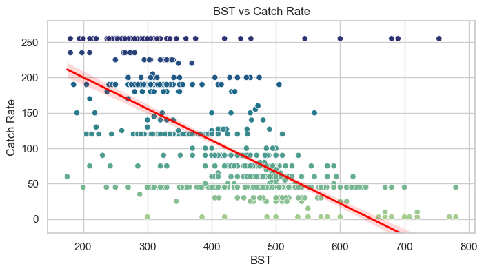

| Catch Rate Bracket | Average BST |
|---|---|
| 0-50 (Very Hard) | 506.70 |
| 51-100 (Hard) | 465.62 |
| 101-150 (Medium) | 351.68 |
| 151-200 (Easy) | 322.01 |
| 201-255 (Very Easy) | 299.17 |

---

### Strongest and Weakest Types

The analysis combined both Type 1 (primary) and Type 2 (secondary) average BST values to find the strongest and weakest typings overall.

**Top 3 Strongest Types (by avg BST):**
- Dragon
- Psychic
- Steel

Dragon types sitting at the top isn't surprising. A huge chunk of Legendary Pokemon are Dragon-type, and that pulls the average BST way up. Psychic benefits from similar Legendary representation (Mewtwo, Deoxys, Lugia, etc.). Steel types are naturally tanky with high defensive stats.

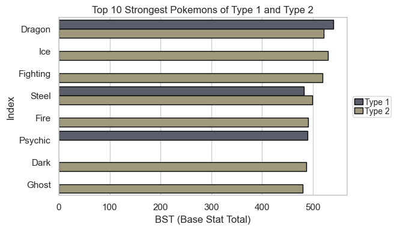

| Type | Avg BST | Category |
|---|---|---|
| Dragon | 539.79 | Primary |
| Ice | 529.33 | Secondary |
| Dragon | 520.67 | Secondary |
| Fighting | 519.10 | Secondary |
| Steel | 498.74 | Secondary |
| Fire | 490.29 | Secondary |
| Psychic | 489.71 | Primary |
| Dark | 487.27 | Secondary |
| Steel | 482.03 | Primary |
| Ghost | 480.04 | Secondary |

**Top 3 Weakest Types (by avg BST):**
- Bug
- Normal
- Poison

Bug types at the bottom also tracks. Most Bug Pokemon are early-route encounters designed to evolve quickly and be replaced. They're intentionally weak as a game design choice.

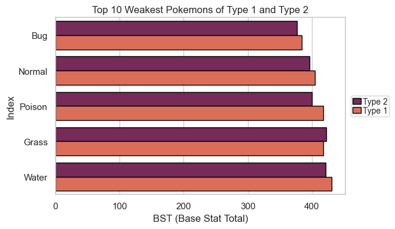

| Type | Avg BST | Category |
|---|---|---|
| Bug | 377.00 | Secondary |
| Bug | 384.62 | Primary |
| Normal | 396.70 | Secondary |
| Poison | 400.41 | Secondary |
| Normal | 404.61 | Primary |
| Grass | 418.24 | Primary |
| Poison | 418.28 | Primary |
| Water | 422.00 | Secondary |
| Grass | 422.86 | Secondary |
| Water | 430.48 | Primary |

---

### Legendary Distribution by Type

Not all types produce Legendaries equally. The analysis looked at what percentage of each type's roster is Legendary.

For **Type 1 (primary type)**, Dragon and Psychic types have the highest Legendary percentages. These are the "elite" typings in the franchise, and the numbers back it up. Types like Bug, Normal, and Poison have extremely low Legendary representation, if any at all.

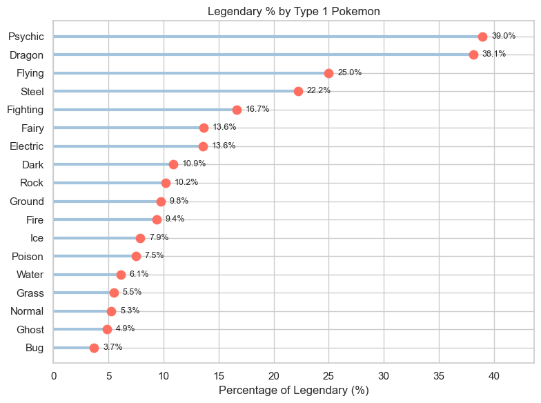

| Primary Type | Legendary % |
|---|---|
| Psychic | 38.96% |
| Dragon | 38.10% |
| Flying | 25.00% |
| Steel | 22.22% |
| Fighting | 16.67% |
| Fairy | 13.64% |
| Electric | 13.56% |
| Dark | 10.87% |
| Rock | 10.17% |
| Ground | 9.76% |

For **Type 2 (secondary type)**, the distribution shifts a bit, but Dragon and Psychic still show up prominently.

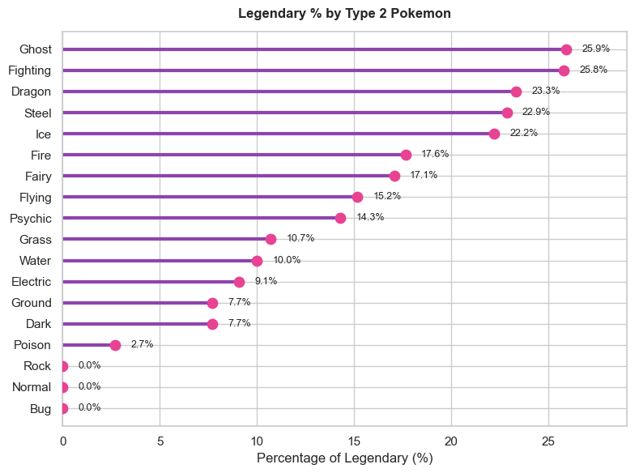

| Secondary Type | Legendary % |
|---|---|
| Ghost | 25.93% |
| Fighting | 25.81% |
| Dragon | 23.33% |
| Steel | 22.86% |
| Ice | 22.22% |
| Fire | 17.65% |
| Fairy | 17.07% |
| Flying | 15.18% |
| Psychic | 14.29% |
| Grass | 10.71% |

This matters because when Dragon-type has the highest average BST, part of that is because such a large portion of Dragon Pokemon are Legendaries, which naturally inflates the average. It's not that every Dragon is strong; it's that the strong ones (Rayquaza, Dialga, Giratina, Zygarde) pull the whole type's average up.

---

### Does Weight Matter?

**Correlation: r = +0.48 (moderate positive)**

Heavier Pokemon tend to be stronger, but it's not a reliable predictor by itself. The correlation is moderate at best. You can find heavy Pokemon with average stats and lightweight Pokemon that are absolute monsters (looking at you, Mega Mewtwo Y at 33 kg with 780 BST).

The scatter plot colored by generation shows that this relationship holds across all generations. There's no generation where weight suddenly stops mattering or starts mattering more. It's a loose trend that stays loose.

Weight is influenced by things like whether a Pokemon is physical or special-oriented, whether it's a tank or a sweeper, and what the design aesthetic is. So while there's a connection to BST, treating weight as a strength indicator would lead you wrong plenty of times.

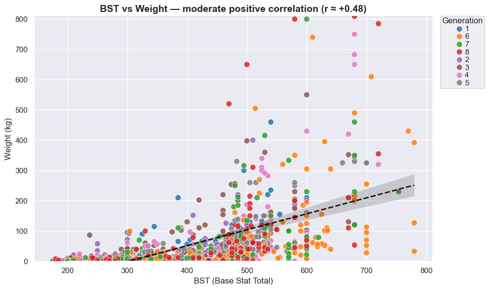

| Weight Bracket | Average BST |
|---|---|
| 0-20kg (Light) | 353.63 |
| 21-50kg (Medium-Light) | 447.90 |
| 51-100kg (Medium) | 498.43 |
| 101-200kg (Heavy) | 530.18 |
| 201kg+ (Very Heavy) | 592.24 |

---

### Final Evolution and Strength

| Category | Avg BST |
|----------|:-------:|
| Not Final Evolution (can still evolve) | 332.13 |
| Final Evolution (fully evolved) | 520.69 |

**Correlation: r = +0.775 (strong positive)**

Final evolution Pokemon are about **56.8% stronger** on average. The correlation of 0.775 is one of the strongest in this entire analysis. Evolution in Pokemon is not just cosmetic; it comes with a serious stat boost.

The violin plot shows this clearly. Non-final Pokemon are tightly clustered in the 200-400 BST range, while final evolutions spread much wider, reaching into the 600-700+ territory. There's very little overlap at the top end.

If you're building a competitive team or just trying to clear the main story, the data says: evolve your Pokemon. The stat jump is real and consistent.

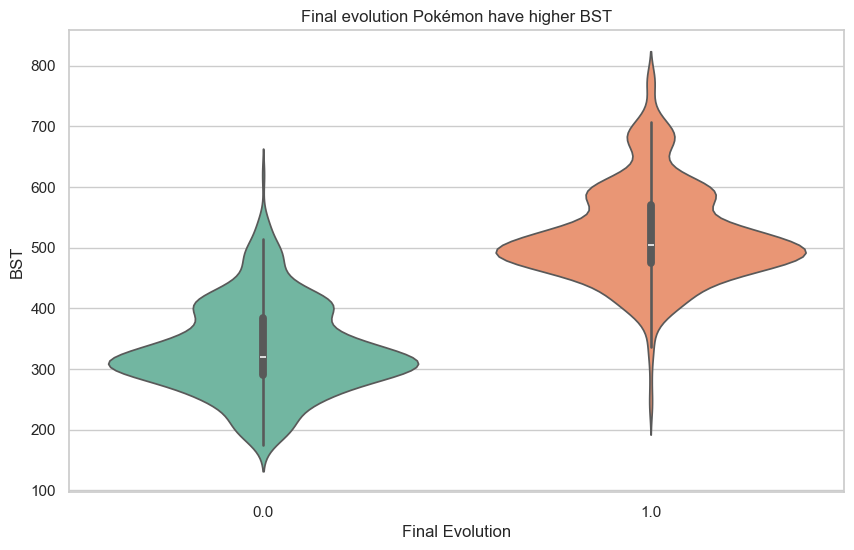

---

### Type Effectiveness and Defensive Vulnerability

This part calculated the average damage multiplier each type receives across all 18 attacking types. A value above 1.0 means the type takes more damage than normal on average. Below 1.0 means it resists more attacks than it's weak to.

**Most Vulnerable Types (highest avg damage taken):**

| Type | Avg Damage Multiplier |
|------|:---------------------:|
| Ice | 1.20 |
| Rock | 1.19 |
| Grass | 1.17 |

Ice, Rock, and Grass types consistently show up as the most defensively vulnerable in both primary and secondary type analysis. They have more weaknesses than resistances across the board.

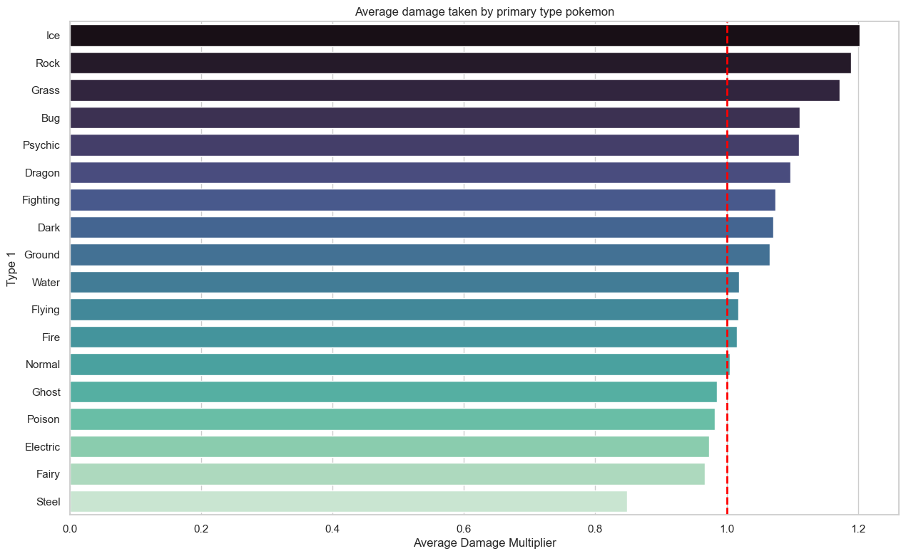

*Top 5 Most Vulnerable and Top 5 Most Resistant Primary Types:*
| Primary Type | Avg Damage Taken Multiplier |
|---|---|
| Ice | 1.20 |
| Rock | 1.19 |
| Grass | 1.17 |
| Bug | 1.11 |
| Psychic | 1.11 |
| ... | ... |
| Ghost | 0.98 |
| Poison | 0.98 |
| Fairy | 0.97 |
| Electric | 0.97 |
| Steel | 0.85 |

**Most Resistant Types (lowest avg damage taken):**

| Type | Avg Damage Multiplier |
|------|:---------------------:|
| Steel | 0.85 |
| Fairy | 0.97 |
| Electric | 0.97 |

Steel is the clear winner on the defensive end. An average multiplier of 0.85 means Steel types resist a lot of incoming damage on average. If you ever wondered why Steelix, Ferrothorn, and Aegislash feel so hard to take down, this is the statistical reason.

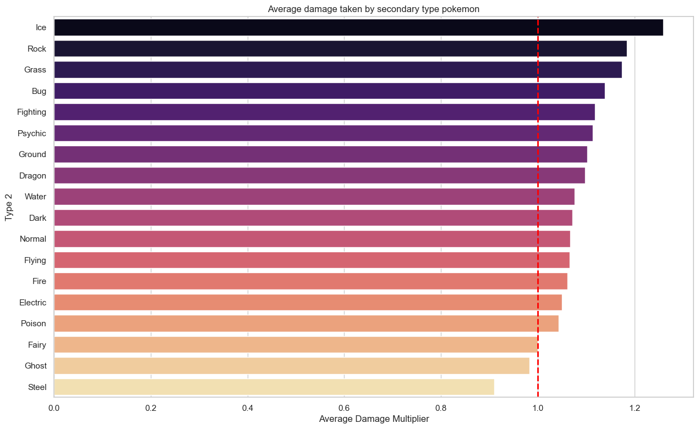

*Top 5 Most Vulnerable and Top 5 Most Resistant Secondary Types:*
| Secondary Type | Avg Damage Taken Multiplier |
|---|---|
| Ice | 1.26 |
| Rock | 1.18 |
| Grass | 1.17 |
| Bug | 1.14 |
| Fighting | 1.12 |
| ... | ... |
| Electric | 1.05 |
| Poison | 1.04 |
| Fairy | 1.00 |
| Ghost | 0.98 |
| Steel | 0.91 |

---

### Z-Score Outliers

Z-Score measures how far a Pokemon's BST deviates from the dataset average (438.65). A positive Z-Score means above average; negative means below.

**Top 10 Highest Z-Scores:**

| Pokemon | BST | Z-Score |
|---------|:---:|:-------:|
| Mega Mewtwo Y | 780 | +2.83 |
| Mega Mewtwo X | 780 | +2.83 |
| Mega Rayquaza | 780 | +2.83 |
| Primal Kyogre | 770 | +2.75 |
| Primal Groudon | 770 | +2.75 |
| Ultra Necrozma | 754 | +2.61 |
| Arceus | 720 | +2.33 |
| Zacian (Crowned Sword) | 720 | +2.33 |
| Zamazenta (Crowned Shield) | 720 | +2.33 |
| Zygarde Complete | 708 | +2.23 |

The top end is all Legendary/Mega/Primal forms. No regular Pokemon even comes close to a Z-Score of +2.0.

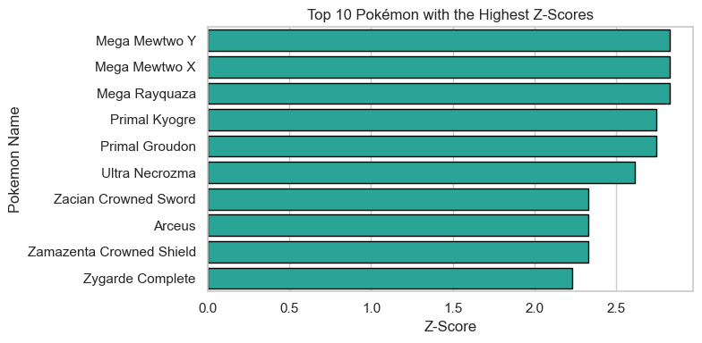

**Top 10 Lowest Z-Scores:**

| Pokemon | BST | Z-Score |
|---------|:---:|:-------:|
| Wishiwashi | 175 | -2.18 |
| Sunkern | 180 | -2.14 |
| Blipbug | 180 | -2.14 |
| Snom | 185 | -2.10 |
| Azurill | 190 | -2.06 |
| Kricketot | 194 | -2.03 |
| Caterpie | 195 | -2.02 |
| Weedle | 195 | -2.02 |
| Wurmple | 195 | -2.02 |
| Ralts | 198 | -1.99 |

On the bottom end, it's mostly early-route Bug types and baby Pokemon. Ralts showing up there is funny because Gardevoir (its final form) is actually quite strong, but base Ralts is one of the weakest Pokemon in the game.

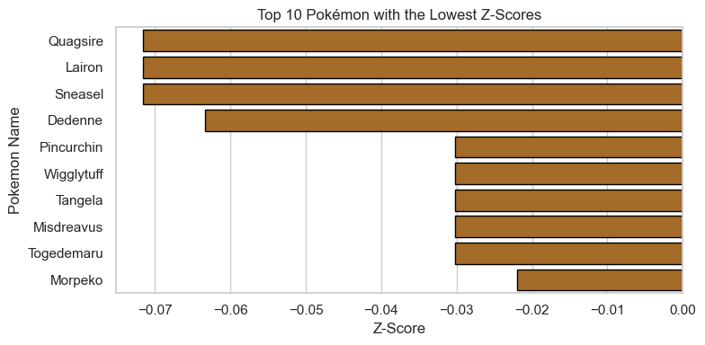

---

### Experience Growth and Strength

**Correlation: r = +0.31 (weak positive)**

Pokemon that need more experience points to hit Level 100 tend to have slightly higher BST on average. But the correlation is weak. Knowing a Pokemon's growth rate won't tell you much about how strong it will be.

This makes sense because experience growth rates were designed around game pacing, not competitive balance. A "Slow" growth Pokemon isn't necessarily stronger than a "Fast" growth one. Plenty of powerful Pokemon use Medium Slow or Medium Fast experience curves.

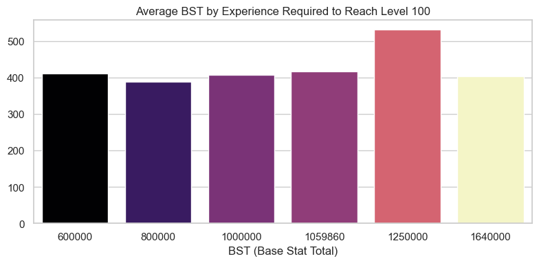

| Experience Required (Lvl 100) | Average BST |
|---|---|
| 600,000 | 411.58 |
| 800,000 | 388.91 |
| 1,000,000 | 407.09 |
| 1,059,860 | 416.82 |
| 1,250,000 | 530.46 |
| 1,640,000 | 403.21 |

---

### Which Stat Drives Overall Strength?

The correlation heatmap between individual battle stats and BST reveals which stats matter most for overall power:

| Stat | Correlation with BST |
|------|:--------------------:|
| Attack | 0.742 |
| Sp. Attack | 0.736 |
| Sp. Defense | 0.711 |
| HP | 0.636 |
| Defense | 0.619 |
| Speed | 0.561 |

**Attack has the strongest correlation with BST (r = 0.742).** Pokemon with higher overall strength tend to lean into offensive physical power more than any other single stat. Special Attack is right behind at 0.736, so both offensive stats are the biggest drivers.

Speed has the weakest correlation at 0.561. Getting stronger doesn't necessarily mean getting faster. There are plenty of slow, bulky, high-BST Pokemon (Snorlax, Tyranitar, Aggron) that prove this point.

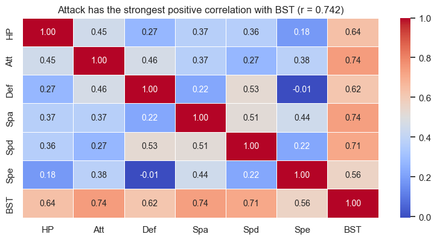

---

## Key Takeaways

### 1. Legendary Status Is the Biggest Strength Indicator
Legendary Pokemon average 609.66 BST compared to 415.08 for non-Legendaries. That 47% gap is the largest single factor in determining overall power across the dataset.

### 2. Evolution Matters. A Lot.
Final evolution Pokemon are 56.8% stronger on average, with a strong correlation (r = 0.775) between evolution status and BST. The game rewards you for evolving.

### 3. The Game Balances Strength with Catch Difficulty
A -0.704 correlation between BST and Catch Rate confirms what every player already feels: the strong ones don't want to stay in the Poke Ball. This is deliberate game design, not coincidence.

### 4. Dragon and Psychic Types Dominate
These two types consistently appear at the top of BST rankings and have the highest Legendary representation. Their average power is inflated by the sheer number of Legendaries in those types.

### 5. Steel Is the Best Defensive Typing
With the lowest average damage multiplier (0.85) across all attack types, Steel Pokemon resist the most incoming damage. If you need a wall on your team, Steel is where to look.

### 6. Ice, Rock, and Grass Are Defensively Fragile
These three types consistently rank as the most vulnerable, taking above-average damage from the widest range of attacking types. Using them competitively requires more careful play and team support.

### 7. Attack Drives Overall Power
Among the six battle stats, Attack correlates most strongly with BST (r = 0.742). Stronger Pokemon tend to hit harder physically. Speed has the weakest relationship, meaning power and speed don't always go together.

### 8. Pokemon Haven't Gotten Consistently Stronger Over Time
The "power creep" narrative doesn't hold up cleanly. Gens 1-3 had nearly identical average BST. Gen 6 spiked because of Mega Evolutions, then it dropped back down. It's more about mechanic additions than gradual inflation.

### 9. Weight Is a Weak Predictor of Strength
A moderate correlation of +0.48 means heavier Pokemon tend to be stronger, but there are plenty of exceptions in both directions. Don't judge a Pokemon by its weight.

### 10. Experience Growth Rate Barely Matters for Strength
The weakest correlation in the entire analysis (r = +0.31). How much EXP a Pokemon needs to reach Level 100 tells you almost nothing about how strong it will end up being.

---

## Tools & Technologies

| Tool | Purpose |
|------|---------|
| **Python** | Core language for all data processing and analysis |
| **Pandas** | Data loading, manipulation, groupby aggregations, correlation analysis |
| **Matplotlib** | Base visualization library for bar charts, scatter plots, and heatmaps |
| **Seaborn** | Statistical visualizations: scatter plots with regression lines, violin plots, heatmaps, bar plots |
| **Jupyter Notebook** | Interactive environment for running the full analysis pipeline |

---

*Analysis conducted on a Pokemon dataset covering 1,032 entries across 8 generations, including Mega Evolutions, Alolan forms, and Galarian forms. All values reflect the raw dataset as provided.*
